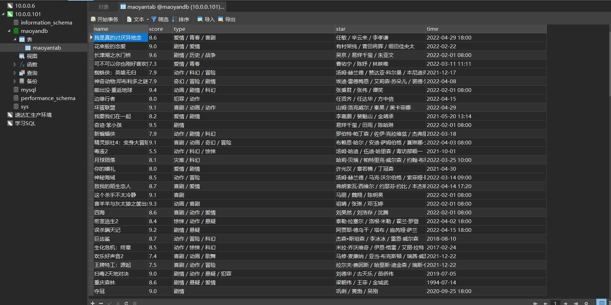
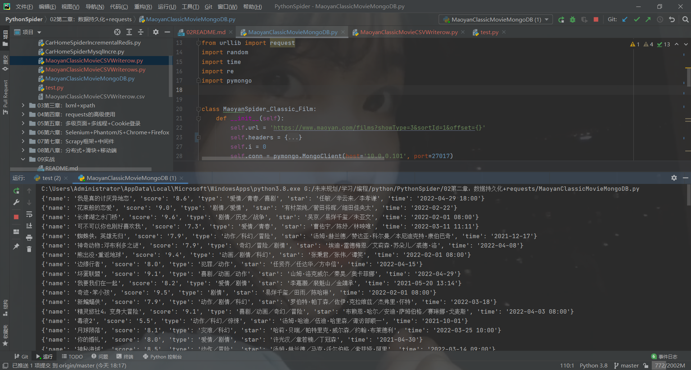
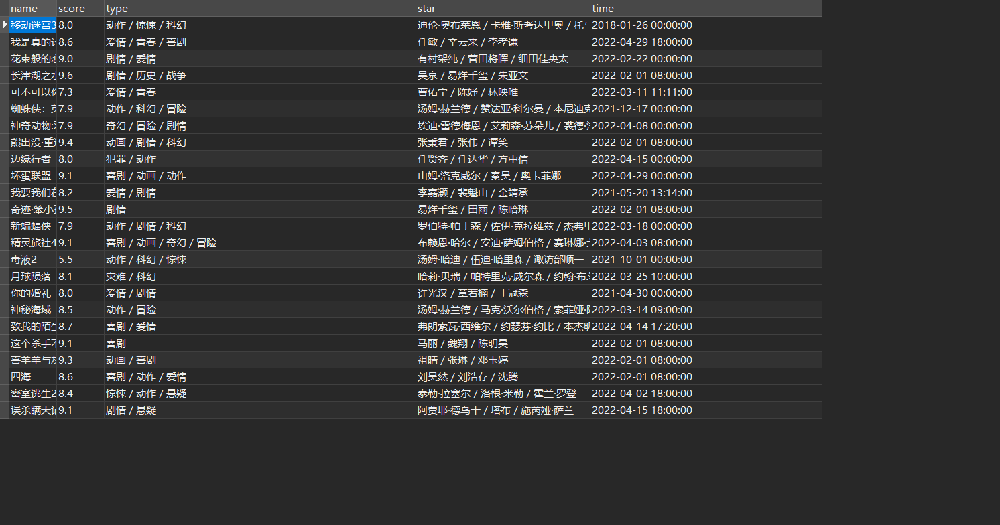
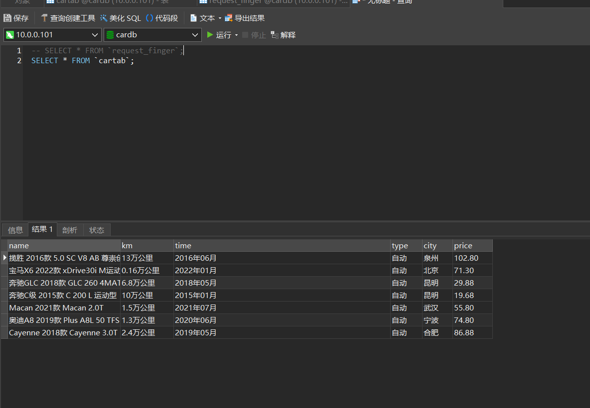
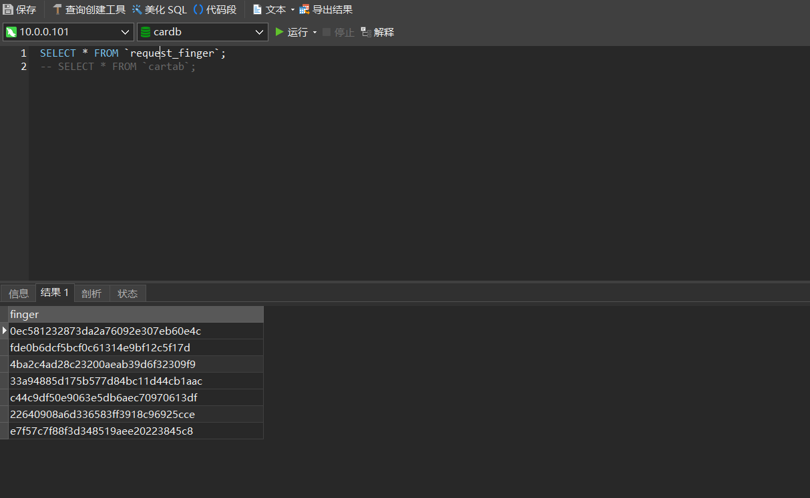
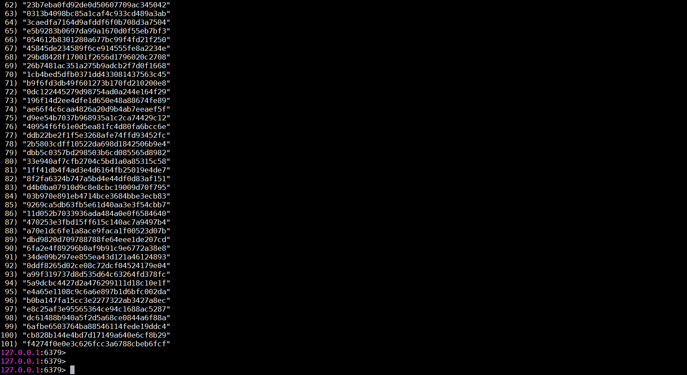

# 数据持久化存储-CSV
**CSV模块**
```text
模块
    -- csv Python标准库模块
作用
    -- 将爬取的数据存放到本地的csv文件中
使用流程
    -- 打开csv文件
    -- 初始化写入对象
    -- 写入数据(参数为列表)
示例
    import csv #导入csv模块
    with open('test.csv', 'w') as f: #正常打开文件,后缀为.csv
        writer = csv.writer(f) #初始化写入对象
        writer.writerow([]) #写入数据
```
**Demo**

```python
#!/usr/bin/python3
# -*- coding: utf-8 -*-
"""
@FileName: test.py
@Time    : 2022/4/30 20:27
@Author  : 热气球
@Software: PyCharm
@Version : 1.0
@Contact : 2573514647@qq.com
@Des     : CSV
"""
import csv

# writerow 单行写入
with open('../02第二章：数据持久化+requests/test.csv', 'w', newline='') as f:
	writer = csv.writer(f)
	writer.writerow(['热气球', '起飞'])
# writerows 一次性写入多行
TV_li = [
	('非自然死亡', '石原里美'),
	('逃避虽然可耻但有用', '新垣结衣'),
	('深夜食堂', '未知master')
]

with open('../02第二章：数据持久化+requests/test.csv', 'w', newline='') as f:
	writer = csv.writer(f)
	writer.writerows(TV_li)
```


**猫眼经典电影-保存为CSV**

[代码-单行写入](https://github.com/LiuShiYa-github/PythonSpider/blob/master/02%E7%AC%AC%E4%BA%8C%E7%AB%A0%EF%BC%9A%E6%95%B0%E6%8D%AE%E6%8C%81%E4%B9%85%E5%8C%96%2Brequests/MaoyanClassicMovieCSVWriterow.py)


[代码-一次性写入多行](https://github.com/LiuShiYa-github/PythonSpider/blob/master/02%E7%AC%AC%E4%BA%8C%E7%AB%A0%EF%BC%9A%E6%95%B0%E6%8D%AE%E6%8C%81%E4%B9%85%E5%8C%96%2Brequests/MaoyanClassicMovieCSVWriterows.py)


# 数据持久化存储-MySQL

**猫眼经典电影-存储在MySQL**

**docekr-compose的MySQL yaml文件**

```yaml
version: '3'
services:
  mysql:
    image: 'mysql/mysql-server:5.7'
    restart: always
    container_name: mysql
    environment:
      MYSQL_ROOT_PASSWORD: 123456
    command:
      --default-authentication-plugin=mysql_native_password
      --character-set-server=utf8mb4
      --collation-server=utf8mb4_general_ci
      --explicit_defaults_for_timestamp=true
      --lower_case_table_names=1
      --max_allowed_packet=128M;
    ports:
      - 3306:3306
```

**pymysql模块**
```text
pymysql模块与Mysql数据库交互流程
    db = pymysql.connect(host='', port='', user='', database='')  # 创建数据库连接对象
    cursor = db.cursor() # 创建游标对象
    cursor.execute() # 执行SQL语句
    db.commit() #  提交到数据库执行
    cursor.close() # 关闭游标
    db.close() # 断开数据库连接
```

**pymysql之excutemany()方法**

```text
作用：
---减少数据库IO次数，提高效率，一次性插入多条表记录

示例：
ins = 'insert into maoyantab values(%s,%s,%s)'
film_li = [
('大话西游之月光宝盒', '周星驰', '1993-01-01'),
'大话西游之月光宝盒', '周星驰', '1994-01-01'
]
cursor.executemany(ins,film_li)
"""

#利用excutemany()方法，一次性插入多条表记录，提升数据库的效率
#1、创建数据库连接对象 + 游标对象
db = pymysql.connect(host='10.0.0.6', user='root', password='123456', database='maoyandb', charset='utf8')
cursor = db.cursor()
#2、利用游标对象的execute（）方法执行SQL命令
ins = 'insert into maoyantab values(%s,%s,%s)'
film_li = [
	('大话西游之月光宝盒', '周星驰', '1993'),
	('大话西游之月光宝盒', '周星驰', '1994'),
	('大话西游之大圣娶亲', '周星驰', '1995'),
	('大话西游之大圣娶亲', '周星驰', '1996')
]
cursor.executemany(ins, film_li)
#3、提交到数据库执行：commit（）
db.commit()
#4、关闭游标 + 断开数据库连接
cursor.close()
db.close()
```

[代码](https://github.com/LiuShiYa-github/PythonSpider/blob/master/02%E7%AC%AC%E4%BA%8C%E7%AB%A0%EF%BC%9A%E6%95%B0%E6%8D%AE%E6%8C%81%E4%B9%85%E5%8C%96%2Brequests/MaoyanClassicMovieMysql.py)



# 数据持久化存储-MongoDB

**MongoDB数据库基础知识**
```text
MongoDB为非关系性数据库，数据以键值对方式存储
MongoDB基于磁盘存储
MongoDB数据类型单一，值为JSON文档，而Redis基于内存
MongoDB：库->集合->文档
Mysql： 库->表->表记录

#查看所有库
show dbs
#切换到指定库
use 库名
#查看当前库中的所有集合
show collections
#查看当前库中的文档
db.集合名.find().pretty()
#统计集合中文档的数量
db.集合名.count()
#删除集合
db.集合名.drop()
#删除当前库
db.dropDatabase()
```


**docker方式运行MongoDB**

```text
docker run -itd --name mongo -p 27017:27017 mongo
docker exec -it mongo mongo
```

**pymongo模块使用流程**

```text
sudo pip install pymongo
import pymongo

#创建连接对象
conn = pymongo.MongoClient(host='10.0.0.101', port=27017)
#创建库对象
db = conn['maoyandb']
#创建集合对象
myset = db['maoyanset']
#在集合中插入文档
myset.insert_one({'name': '泰坦尼克号', 'star': 'T', 'time': '1990-01-01'})
#在集合中批量插入文档
myset.insert_many({'name': '泰坦尼克号', 'star': 'T', 'time': '1990-01-01'})
注意：MongoD无需提前建库建表。直接操作即可，会自动建库建表
```

**猫眼经典电影-存储在MongoDB**

[代码](https://github.com/LiuShiYa-github/PythonSpider/blob/master/02%E7%AC%AC%E4%BA%8C%E7%AB%A0%EF%BC%9A%E6%95%B0%E6%8D%AE%E6%8C%81%E4%B9%85%E5%8C%96%2Brequests/MaoyanClassicMovieMongoDB.py)




# 多级页面抓取

**多级页面抓取逻辑**

```text
当在一级页面中无法获取到目标数据时,则获取二级页面的url地址并对二级页面URL发起请求并获取响应数据.

1.查看网页源码,搜索目标数据,如果没有目标数据则搜索二级页面url信息
2.查看二级页面源码并搜索目标数据
3.观察一级页面url规律
4.从一级页面获取url信息后向url发送请求获取目标数据
```

[代码](https://github.com/LiuShiYa-github/PythonSpider/blob/master/02%E7%AC%AC%E4%BA%8C%E7%AB%A0%EF%BC%9A%E6%95%B0%E6%8D%AE%E6%8C%81%E4%B9%85%E5%8C%96%2Brequests/CarHomeSpider.py)


# requets模块

**requests请求模块**
```text
功能:
    类似于urllib库,向网站发送请求获取响应,为第三方模块
安装:
    Linux: sudo pip3 install requests
    windows: python -m pip install requests
常用方法:
    res = requests.get(url=url, headers=headers)
```

[requests官网](https://pypi.org/project/requests/)


# 增量爬虫-MySQL以及Redis实现

**增量爬虫-MySQL**

```text
定义:
    每次爬取只抓取新更新的链接,之前抓取过的链接不会再继续抓取

实现思路:
    MySQL中新建指纹表,用来存储所有爬取过的链接的指纹
    在爬取任何链接之前,先判断指纹是否存在与指纹表,如果已存在则不再进行爬取
  
注意:
    对于常规网站来说,新更新的数据一般会在前面.比如新闻类网站(新更新的新闻会在页面顶部)
    
    所以,一旦检测到有链接已经爬取过,则无需再检测其之后的链接,终止程序即可.

如何给url地址进行MD5加密生成指纹？
    from hashlib import md5

    s=md5()
    s.update(url.encode())
    finger = s.hexdigest()
```

**建库建表语句**
```sql
#创建库以及指纹表
create database cardb charset utf8;
use cardb;
create table request_finger(
finger char(32)
)charset=utf8;

#创建存储所抓取数据的表
create table cartab(
name varchar(100),
km varchar(50),
time varchar(50),
type varchar(50),
city varchar(50),
price varchar(50)
)charset=utf8;
```

**MySQL数据库授权远程连接**

```sql
use mysql；
select  User,authentication_string,Host from user;
GRANT ALL PRIVILEGES ON *.* TO 'root'@'%' IDENTIFIED BY '123456' ;
flush privileges; 
```

[代码](https://github.com/LiuShiYa-github/PythonSpider/blob/master/02%E7%AC%AC%E4%BA%8C%E7%AB%A0%EF%BC%9A%E6%95%B0%E6%8D%AE%E6%8C%81%E4%B9%85%E5%8C%96%2Brequests/CarHomeSpiderMysqlIncre.py)





**增量爬虫-Redis**

**原理**
```text
原理:
    redis基于内存,效率极高
    利用redis中集合的特性,自动去重,可以轻松管理所有请求的指纹
实现思路:
    利用集合的sadd()方法向集合中添加指纹,根据返回值来判断集合中是否存在该指纹
    添加成功返回1,表示此请求之前并未抓取过
    添加失败返回0,表示此请求之前已经抓取过
```

[代码](https://github.com/LiuShiYa-github/PythonSpider/blob/master/02%E7%AC%AC%E4%BA%8C%E7%AB%A0%EF%BC%9A%E6%95%B0%E6%8D%AE%E6%8C%81%E4%B9%85%E5%8C%96%2Brequests/CarHomeSpiderIncrementalRedis.py)

