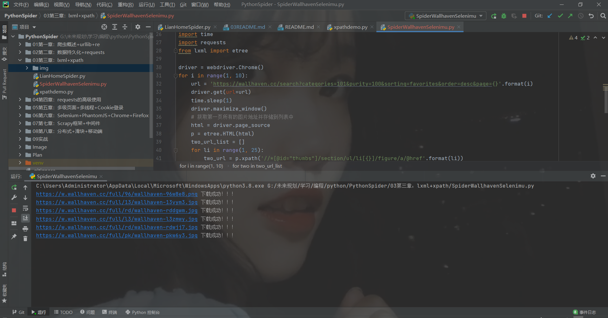
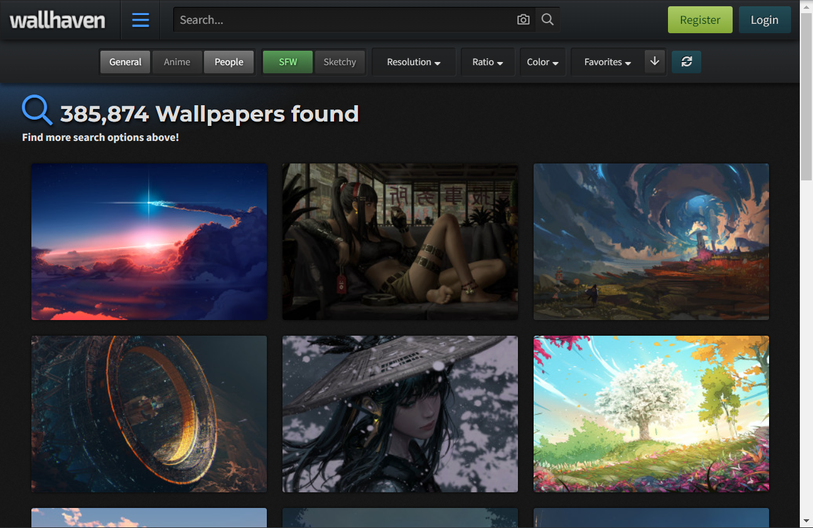
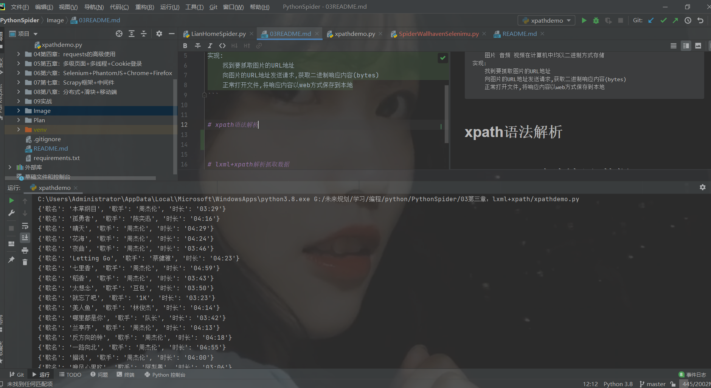
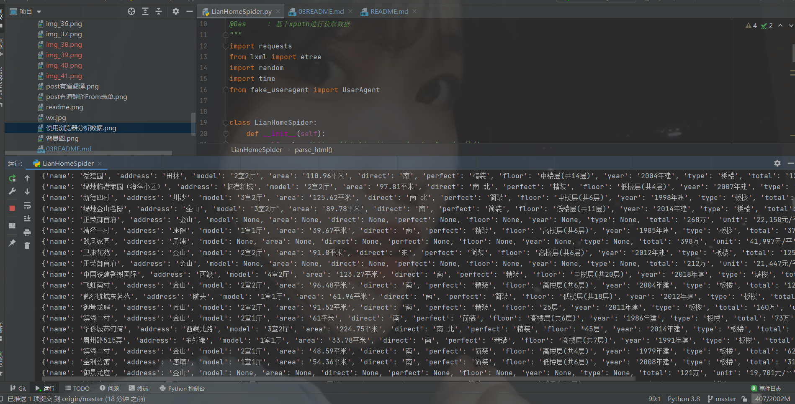

# 图片抓取
```text
说明:
    图片 音频 视频在计算机中均以二进制方式存储
实现:
    找到要抓取图片的URL地址
    向图片的URL地址发送请求,获取二进制响应内容(bytes)
    正常打开文件,将响应内容以web方式保存到本地
```

**图片抓取-爬取wallhaven.cc**

[代码](https://github.com/LiuShiYa-github/PythonSpider/blob/master/03%E7%AC%AC%E4%B8%89%E7%AB%A0%EF%BC%9Alxml%2Bxpath/SpiderWallhavenSelenimu.py)






# xpath语法解析

**xpath抓取QQ音乐热歌榜**

[代码](https://github.com/LiuShiYa-github/PythonSpider/blob/master/03%E7%AC%AC%E4%B8%89%E7%AB%A0%EF%BC%9Alxml%2Bxpath/xpathdemo.py)




# lxml+xpath解析抓取数据


**基于xpath抓取链家二手房**

[基于xpath抓取链家二手房](https://github.com/LiuShiYa-github/PythonSpider/blob/master/03%E7%AC%AC%E4%B8%89%E7%AB%A0%EF%BC%9Alxml%2Bxpath/LianHomeSpider.py "悬停显示")

