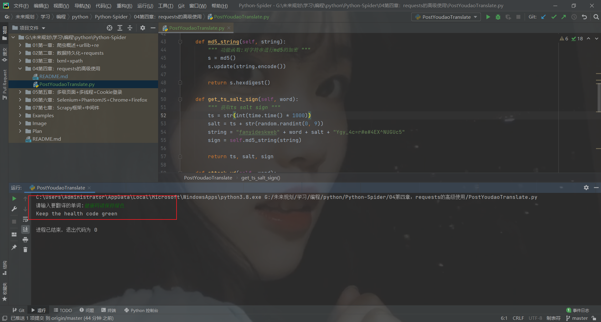

# requests的高级使用

### 代理IP的使用


```text
代理IP定义：代替你原来的IP地址去对接网络的IP地址
作用：隐藏自身真是IP，避免被目标网站封掉。

代理IP分类：
高匿代理：web端只能看到代理IP
普通代理：web端知道有人通过此代理IP访问，但不知道用户真是IP
透明代理：web端能看到用户真实IP，也能看到代理IP

应用场景：
针对高频率访问的IP地址进行了反爬机制，封掉IP地址的网站

代理IP地址：自行百度代理IP
```


语法格式
```python
        proxies = {
            'http': 'http://IP:端口号',
            'https': 'http://IP:端口号'
        }
       res = requests.get(url=self.test_url, proxies=proxies, headers=self.headers, timeout=2)
```

示例
```python
#!/usr/bin/python3
# -*- coding: utf-8 -*-
"""
@FileName: ProxyIpPool.py
@Time    : 2022/3/14 8:53
@Author  : 热气球
@Software: PyCharm
@Version : 1.0
@Contact : 17695691664@163.com
@Des     : 抓取飞度代理的免费高匿代理并测试可用性
"""

import requests
import re
from fake_useragent import UserAgent


class ProxyPool:
    def __init__(self):
        self.proxy_url = 'http://www.feidudaili.com/index/gratis/index?page={}'
        self.test_url = 'https://www.baidu.com/'
        self.headers = {'User-Agent': UserAgent().random}
        self.ip_list = []

    def get_proxy_pool(self, url):
        try:
            html = requests.get(url=url, headers=self.headers, timeout=3).text
            self.parse_html(html=html)
        except Exception as e:
            print('页面响应超时，重试中。。。。。。')

    def parse_html(self, html):
        regex = '<tr>.*?<td>(.*?)</td>.*?<td>(.*?)</td>.*?<td>.*?</td>.*?</td>.*?</tr>'
        pattern = re.compile(regex, re.S)
        r_list = pattern.findall(html)
        try:
            for li in r_list:
                host = li[0]
                port = li[1]
                ipaddress = host + ':' + port
                self.test_proxy(proxy=ipaddress)
        except IndexError as e:
            print(e)

    def test_proxy(self, proxy):
        """ 测试一个代理IP地址是否可用 """
        proxies = {
            'http': 'http://{}'.format(proxy),
            'https': 'http://{}'.format(proxy)
        }
        try:
            res = requests.get(url=self.test_url, proxies=proxies, headers=self.headers, timeout=2)
            if res.status_code == 200:
                print(proxy, '\033[32m可用\033[0m')
                html = requests.get(url='http://httpbin.org/get', headers=self.headers, proxies=proxies, timeout=3).text
                print('html:', html)
                self.ip_list.append(proxy)
        except Exception as e:
            print(proxy, '\033[31m不可用\033[0m')

    def run(self):
        for pg in range(1, 4504):
            url = self.proxy_url.format(pg)
            self.get_proxy_pool(url=url)


if __name__ == '__main__':
    spider = ProxyPool()
    spider.run()
    print('可用的代理列表为：', spider.ip_list)
```

效果展示


### requests.post()方法

**适用场景**

post类型请求的网站

**参数说明**

参数名为data,类型为字典

res = requests.post(url=url,data=data,headers=headers)

**post请求特点**

以Form表单进行提交数据


**使用浏览器分析数据**


①F12 点击network

②选择ALL 查看所有的网络数据包

③选择网络数据包

④选择要查看的信息

**解释:**

ALL:所有的网络数据包

XHR:异步加载的网络数据包

JS:加载的JS文件信息

...

Headers:请求头信息

Preview:预览信息

Response:响应的内容

**post方式请求有道翻译并获取翻译内容**


**实现逻辑:post向url发起请求并携带From表单,获取到HTML信息,并从中提取出翻译的内容.**

**难点: 破解反爬的验证,涉及到js加密**


salt: 16476853549203

sign: d3b8cfa182556ac326e8475567b58d7c

lts: 1647685354920

bv: 75adedb929794295187b046da37b1fc1

经过翻译多个单词找到规律

bv不变 salt\sign\lts会变化

下一步就是找到加密的规则,猜测是js加密,那么就观察js进行验证


搜索加密的字符


获取到加密方式后进行实现


小技巧快速生成字典


代码[PostYoudaoTranslate.py]

**效果展示**




