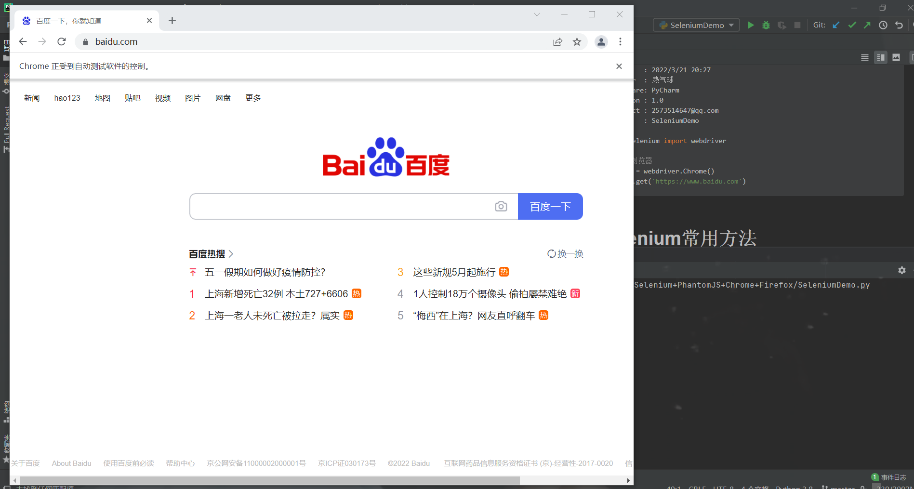
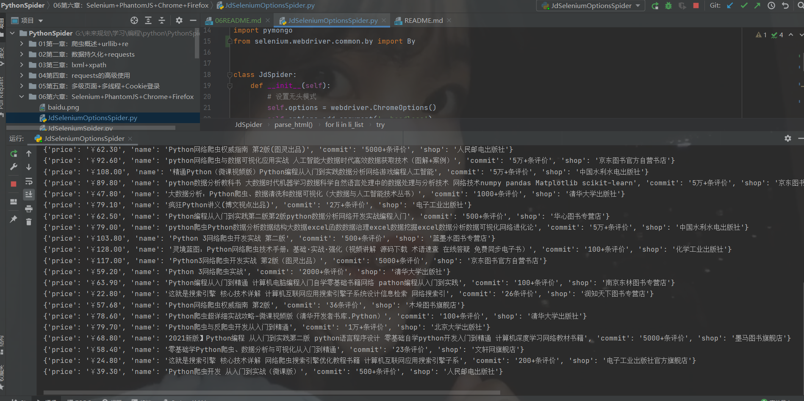
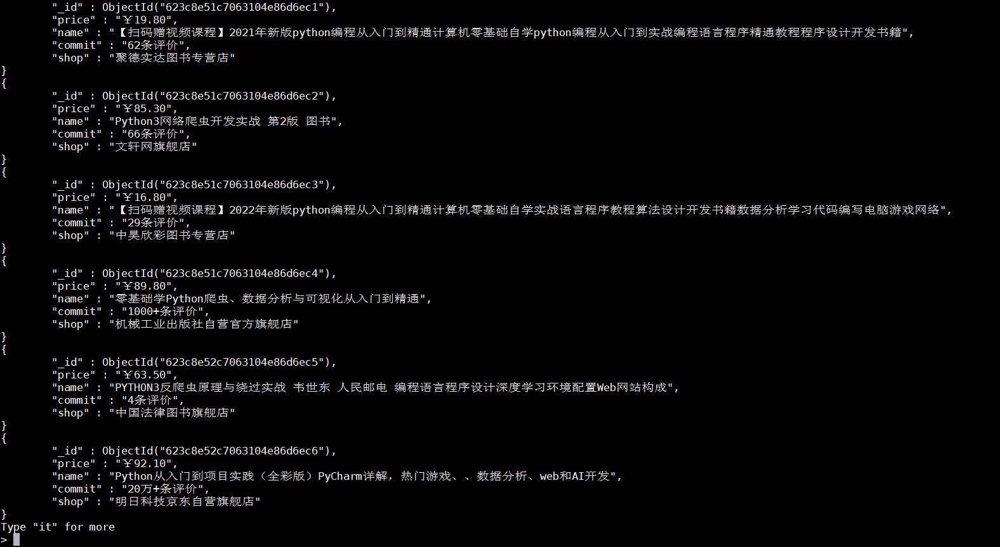

# Selenium+PhantomJS Chrome Firefox

**Selenium概述**

```text
定义:
    开源的web自动化测试工具
特点:
    可根据指令操控浏览器
    只是工具,必须与第三方浏览器结合使用
安装:
    linux: sudo pip3 install selenium
    windows: python -m pip install selenium
```

**环境安装**

```text
以下三种方式安装一组即可
    selenium + PhantomJS
    selenium + chromedriver +Chrome
    selenium + geckodriver +Firefox
说明:
    以上3种组合任选其一,都可以实现基于selenium的强大网络爬虫
    Chrome需要安装浏览器驱动器: chromedriver
    Firefox需要安装浏览器驱动器: geckodriver
```

**Demo**

```python
#!/usr/bin/python3
# -*- coding: utf-8 -*-
"""
@FileName: SeleniumDemo.py
@Time    : 2022/3/21 20:27
@Author  : 热气球
@Software: PyCharm
@Version : 1.0
@Contact : 2573514647@qq.com
@Des     : SeleniumDemo
"""
from selenium import webdriver

# 谷歌浏览器
driver = webdriver.Chrome()
driver.get('https://www.baidu.com')
```


# Selenium常用方法

**浏览器对象**

```text
浏览器对象browser常用方法及属性
    browser.get(): 地址栏输入URL地址并确认
    browser.quit(): 关闭浏览器
    browser.close(): 关闭当前页
    browser.maximize_window(): 浏览器窗口最大化
    browser.page_source(): HTML结构源码
    browser.page_source.find('字符串'): 从源码中查找指定字符串,没有返回-1.常用于判断最后一页
```

**定位节点**

```text
单元素查找 - 返回值为节点对象
    browser.find_element_by_id('id属性值')
    browser.find_element_by_name('name属性')
    browser.find_element_by_class_name('class属性值')
    browser.find_element_by_xpath('xpath表达式')
    browser.find_element_by_link_text('链接文本')
    browser.find_element_by_partical_linnk_text('部分链接文本')
    browser.find_element_by_tag_name('标记名称')
    browser.find_element_by_css_selector('css表达式')
```

**节点对象方法**

```text
节点对象常用属性以及方法:
    node.send_keys(): 向文本框发送内容
    node.click(): 点击
    node.clear(): 清空文本
    node.get_attribute('属性名'): 获取节点属性值
    node.text():获取节点文本内容(包含子节点和后代节点)
```
selenium执行JS脚本

```text
浏览器对象执行JS脚本方法:
    browser.execute_script()
最常用脚本:
    把滚动条拉到底部
    from selenium import webdriver
    browser = webdriver.Chrome()
    browser.execute_script(
		'window.scrollTo(0,document.body.scrollHeight)'
	)
```

# Selenium高级操作

**selenium模拟键盘行为**

```text
#!/usr/bin/python3
# -*- coding: utf-8 -*-
"""
@FileName: SeleniumKeys.py
@Time    : 2022/3/24 23:35
@Author  : 热气球
@Software: PyCharm
@Version : 1.0
@Contact : 2573514647@qq.com
@Des     : selenium模拟键盘行为
"""
from selenium import webdriver
from selenium.webdriver.common.keys import Keys

browser = webdriver.Chrome()
browser.get('https://www.baidu.com')
# 1 在搜索框中输入赵丽颖
browser.find_element_by_id('kw').send_keys('赵丽颖')
# 2 输入空格
browser.find_element_by_id('kw').send_keys(Keys.SPACE)
# 3 ctrl+a 模拟全选
browser.find_element_by_id('kw').send_keys(Keys.CONTROL, 'a')
# 4 ctrl+c 模拟复制
browser.find_element_by_id('kw').send_keys(Keys.CONTROL, 'c')
# 5 ctrl+v 模拟粘贴
browser.find_element_by_id('kw').send_keys(Keys.CONTROL, 'v')
# 6 输入回车代替搜索按钮
browser.find_element_by_id('kw').send_keys(Keys.ENTER)
```

**selenium frame**

```text
特点:
    网页中嵌套了网页,先切换frame,然后再去其他操作
处理步骤:
    切换到要处理的frame
    在frame中定位页面元素并进行操作
    返回当前处理的Frame的上一级页面或主页面
```

**Demo**

```python
#!/usr/bin/python3
# -*- coding: utf-8 -*-
"""
@FileName: SeleniumLoginQQmail.py
@Time    : 2022/3/25 11:26
@Author  : 热气球
@Software: PyCharm
@Version : 1.0
@Contact : 2573514647@qq.com
@Des     : 使用selenium模拟登录QQ邮箱
"""
import time

from selenium import webdriver

driver = webdriver.Chrome()
driver.get(url='https://mail.qq.com/')
driver.maximize_window()
# 1 切换iframe子页面
driver.switch_to.frame('login_frame')
# 2 用户名密码登录
driver.find_element_by_id('u').send_keys('xxx')
time.sleep(2)
driver.find_element_by_id('p').send_keys('xxx')
time.sleep(2)
driver.find_element_by_id('login_button').click()
# driver.quit()
```


[selenium无头模式爬取京东爬虫类图书](https://github.com/LiuShiYa-github/PythonSpider/blob/master/06%E7%AC%AC%E5%85%AD%E7%AB%A0%EF%BC%9ASelenium%2BPhantomJS%2BChrome%2BFirefox/JdSeleniumOptionsSpider.py)



