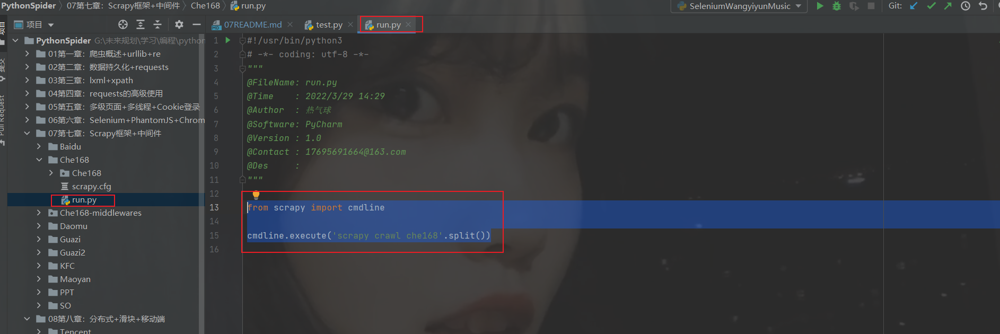
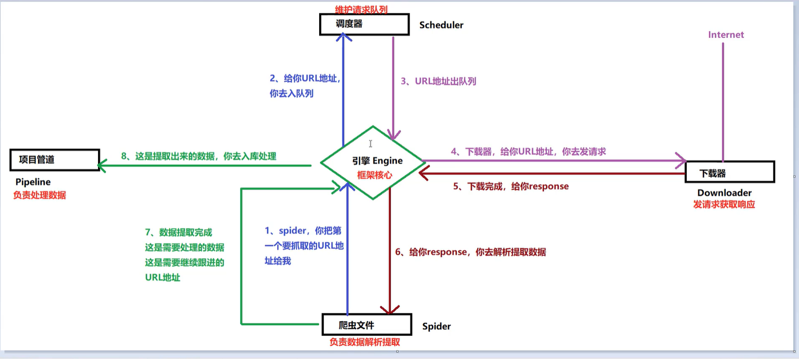
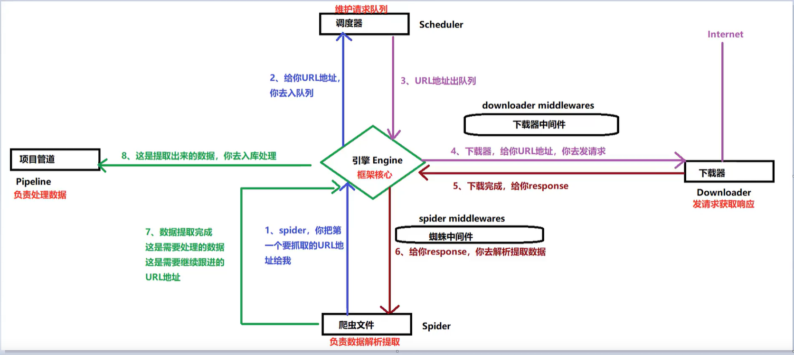
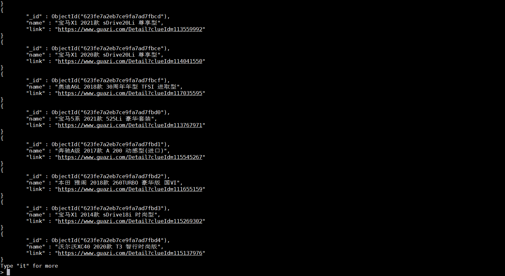

# Scrapy框架原理

**Scrapy特点**

```text
是一个用Python实现的为了爬取网站数据 提取数据的应用框架
Scrapy使用Twisted异步网络库来处理网络通讯
使用Scrapy框架可以高效(爬取效率和开发效率)完成数据爬取
```

**Scrapy安装**

```text
Ubuntu安装:
    sudo pip3 install Scrapy
Windows安装:
    python -m pip install Scrapy
创建项目:
    scrapy startproject 项目名
    scrapy genspider example example.com
```

**运行写好的scrapy项目**
```python
from scrapy import cmdline

cmdline.execute('scrapy crawl che168'.split())
```


**Scrapy五大组件及其作用**

```text
引擎(Engine): 整个框架核心
调度器(Scheduler): 维护请求队列
下载器(Downloader): 获取响应对象
爬虫文件(Spider): 数据解析提取
项目管道(Pipeline): 数据入库处理
```

**Scrapy工作流程**

```text
工作流程描述 - 爬虫项目正式启动
    
    引擎向爬虫程序索要第一批要爬取的URL,交给调度器入队列
    
    调度器处理请求后出队列,通过下载器中间件交给下载器去下载
    
    下载器得到响应对象后,通过蜘蛛中间件交给爬虫程序
    
    爬虫程序进行数据提取
    
    数据交给管道文件去入库处理
    
    对于需要继续跟进的URL再次交给调度器入队列,如此循环
```





# Scrapy配置文件解析

**settings.py详解**

[不再一条条解释-请参考这里的配置文件](https://github.com/LiuShiYa-github/PythonSpider/blob/master/07%E7%AC%AC%E4%B8%83%E7%AB%A0%EF%BC%9AScrapy%E6%A1%86%E6%9E%B6%2B%E4%B8%AD%E9%97%B4%E4%BB%B6/Che168-middlewares/Che168/settings.py)


**示例**

[scrapy抓取che168二收车信息](https://github.com/LiuShiYa-github/PythonSpider/tree/master/07%E7%AC%AC%E4%B8%83%E7%AB%A0%EF%BC%9AScrapy%E6%A1%86%E6%9E%B6%2B%E4%B8%AD%E9%97%B4%E4%BB%B6/Che168)


**Scrapy数据持久化**





# 中间件

# Scrapy处理POST请求

# Scrapy之图片管道

# Scrapy之文件管道


