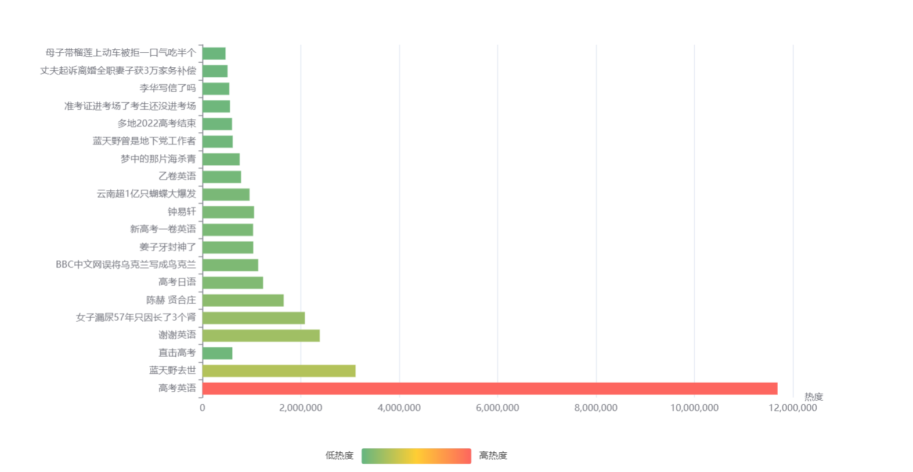
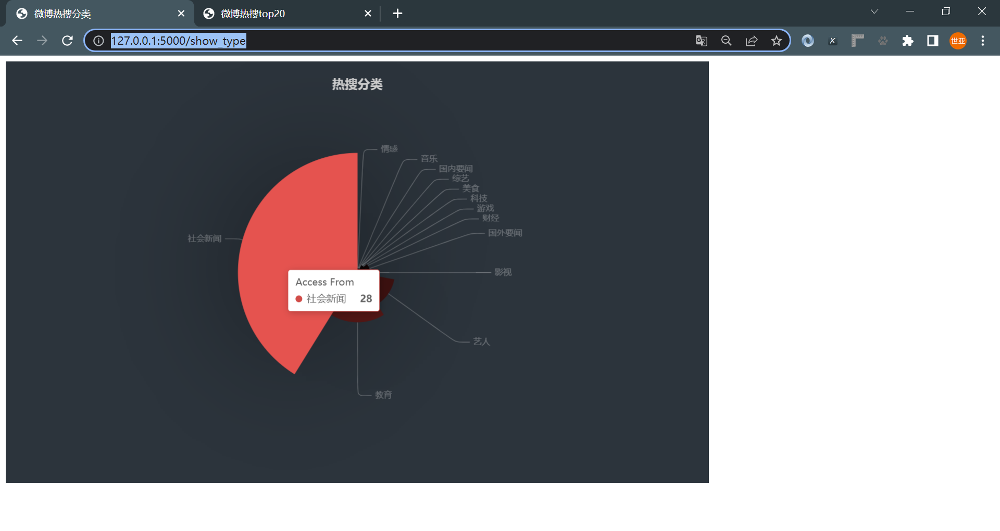
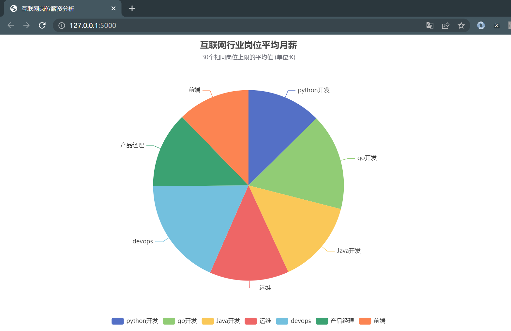
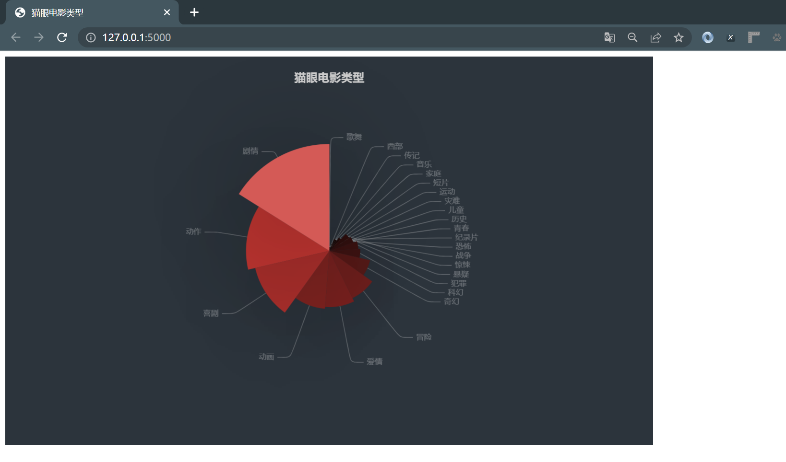

# Flask数据展示

**实现方式**

```text
实现方式是借助Flask+echarts将抓取到的数据填充的前端配置中进行展示到页面。
```

**微博热搜**

[微博热搜top20展示](https://github.com/LiuShiYa-github/PythonSpider/blob/master/10Flask%E6%95%B0%E6%8D%AE%E5%8F%AF%E8%A7%86%E5%8C%96/WeiboFlask.py)





**互联网岗位薪资分析**

[拉勾网互联网岗位信息分析](https://github.com/LiuShiYa-github/PythonSpider/blob/master/10Flask%E6%95%B0%E6%8D%AE%E5%8F%AF%E8%A7%86%E5%8C%96/LagouFlask.py)




**猫眼电影类型展示**

[猫眼电影类型展示](https://github.com/LiuShiYa-github/PythonSpider/blob/master/10Flask%E6%95%B0%E6%8D%AE%E5%8F%AF%E8%A7%86%E5%8C%96/MaoyanFilmFlask.py)

