# 动态加载数据爬取

**动态加载网站特点**

```text
右键查看网页源代码中没有具体数据

滚动滑轮或其他动作时才会有数据加载

页面局部刷新

此类网站有:腾讯招聘\英雄互娱招聘\豆瓣电影排行榜等
```

**动态加载数据分析抓取流程**
```text
F12打开控制台 - 执行页面动作开始抓取网络数据包

抓取返回JSON文件的网络数据包

XHR:异步加载的网络数据包

General - Request URL: 返回JSON数据的URL地址

QueryStingParameter(查询参数) - 观察规律
```


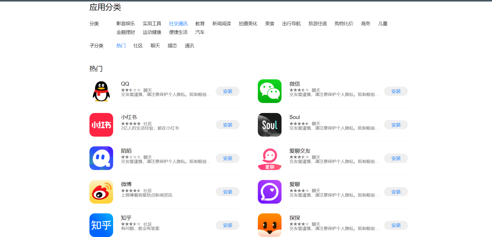

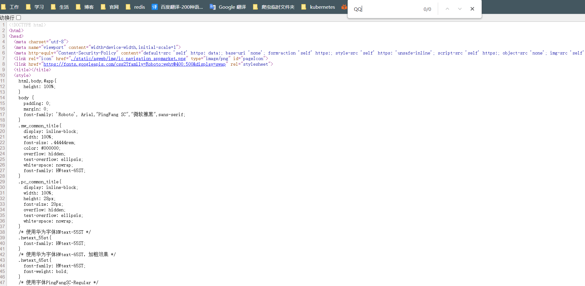

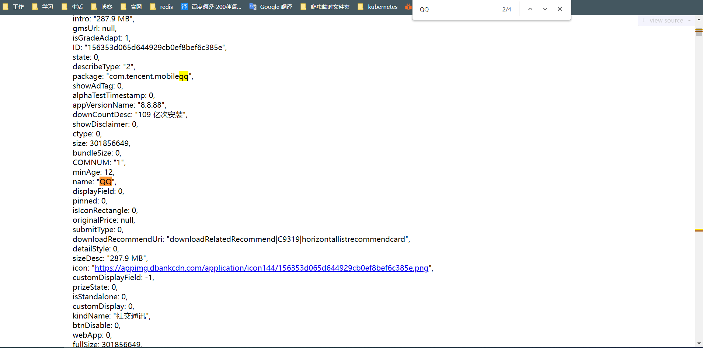


[代码](https://github.com/LiuShiYa-github/PythonSpider/blob/master/05%E7%AC%AC%E4%BA%94%E7%AB%A0%EF%BC%9A%E5%A4%9A%E7%BA%A7%E9%A1%B5%E9%9D%A2%2B%E5%A4%9A%E7%BA%BF%E7%A8%8B%2BCookie%E7%99%BB%E5%BD%95/HuaweiApp.py)

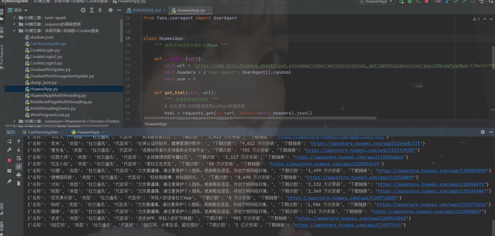

# JSON解析模块及全站抓取

**JSON模块**
```text
json.loads(参数为json格式的字符串)
    
    把json格式的字符串转为python数据类型

    html = json.loads(res.text)


json.dump(python,file,ensure_ascii=False)
    
    把python数据类型转换为json格式的字符串并存入文件
    
    第一个参数: python类型的数据(字典 列表等)
    
    第二个参数: 文件对象
```

**Demo**

```python
#!/usr/bin/python3
# -*- coding: utf-8 -*-
"""
@FileName: dump_json.py
@Time    : 2022/3/20 16:19
@Author  : 热气球
@Software: PyCharm
@Version : 1.0
@Contact : 2573514647@qq.com
@Des     : 
"""
import json

app_list = [
{'名称': '他趣', '类型': '社交通讯', '代言词': '交友需谨慎，请注意保护个人隐私。抵制粗俗语言，共创文明网络环境。', '下载次数': '7,209 万次安装', '下载链接': 'https://appstore.huawei.com/app/C100297699'},
{'名称': '最右', '类型': '社交通讯', '代言词': '最右，一个看搞笑短视频、搞笑帖子的社区', '下载次数': '4 亿次安装', '下载链接': 'https://appstore.huawei.com/app/C10212948'},
{'名称': '本地陌交友', '类型': '社交通讯', '代言词': '交友需谨慎，请注意保护个人隐私。抵制粗俗语言，共创文明网络环境。', '下载次数': '766 万次安装', '下载链接': 'https://appstore.huawei.com/app/C100880143'},
{'名称': '网易大神', '类型': '社交通讯', '代言词': '马上进入游戏热爱者的世界', '下载次数': '1 亿次安装', '下载链接': 'https://appstore.huawei.com/app/C100246713'}
]

with open('app_list.json', 'w', encoding='utf-8') as f:
	json.dump(app_list, f, ensure_ascii=False)
```

**JSON全站抓取**


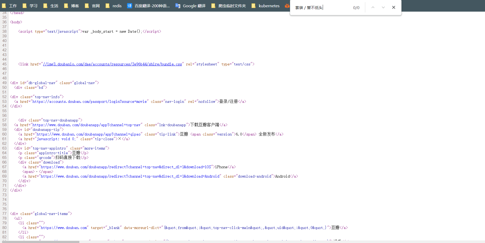

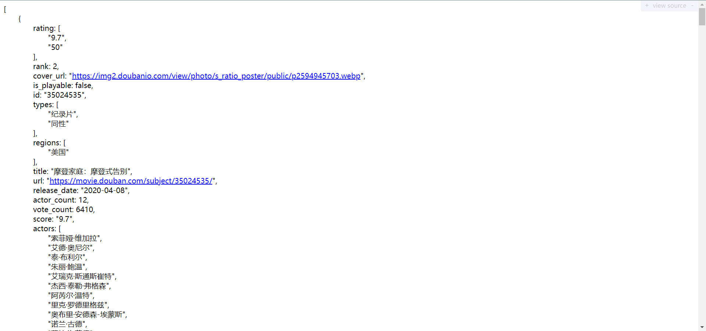

[豆瓣剧情电影排行榜](https://github.com/LiuShiYa-github/PythonSpider/blob/master/05%E7%AC%AC%E4%BA%94%E7%AB%A0%EF%BC%9A%E5%A4%9A%E7%BA%A7%E9%A1%B5%E9%9D%A2%2B%E5%A4%9A%E7%BA%BF%E7%A8%8B%2BCookie%E7%99%BB%E5%BD%95/DoubanPlotSpider.py)


# 多线程爬虫

**多线程应用场景**

```text
多进程适用场景:
    CPU密集的程序适合使用多进程, 可充分利用计算机的多核

多线程应用场景:
    IO操作多的程序适合适用多线程,包括IO 本地磁盘IO
    爬虫发请求等响应: 网络IO
    爬虫处理所抓数据: 本地磁盘IO
    所以适用多线程编写爬虫能够极大提升数据爬取的效率
```

**queue模块+threading模块**
```text
queue模块:
    当队列为空时get()出队列会发生阻塞
    避免阻塞的3种方式
    q.get(block=False)
    q.get(block=True, timeout=3)
    while not q.empty():
        q.get()
        
threading模块:
    导入线程类
    from threading import Thread
    使用流程
    t = Thread(target=事件函数)
    t.start()
    t.join()
```

**Demo**

```python
#!/usr/bin/python3
# -*- coding: utf-8 -*-
"""
@FileName: WireProgramLockDemo.py
@Time    : 2022/3/20 18:10
@Author  : 热气球
@Software: PyCharm
@Version : 1.0
@Contact : 2573514647@qq.com
@Des     : 线程锁Demo
"""

from threading import Thread, Lock

n = 5000

lock = Lock()


def f1():
	global n
	for i in range(100000):
		lock.acquire()
		n += 1
		lock.release()


def f2():
	global n
	for i in range(100000):
		lock.acquire()
		n -= 1
		lock.release()


t1 = Thread(target=f1)
t1.start()

t2 = Thread(target=f2)
t2.start()

t1.join()
t2.join()

print(n)

```

**线程锁**

```text
导入线程锁:
    from threading import Lock

何时加锁:
    当多个线程操作同一个共享资源时,进行加锁

常用方法
    创建锁: lock = Lock()
    上锁: lock.acquire() 
    释放锁: lock.release()
    当上锁成功后,未释放锁之前,再次上锁会阻塞
```

**Demo**

```python
#!/usr/bin/python3
# -*- coding: utf-8 -*-
"""
@FileName: MultithreadingDemo.py
@Time    : 2022/3/20 18:05
@Author  : 热气球
@Software: PyCharm
@Version : 1.0
@Contact : 2573514647@qq.com
@Des     : 多线程Demo
"""

from threading import Thread


def spider():
	print('你爱我呀我爱你,蜜雪冰城甜蜜蜜~')


t_list = []
for i in range(5):
	t = Thread(target=spider)
	t_list.append(t)
	t.start()

for i in t_list:
	t.join()
```

[线程抓取华为应用市场社交类app](https://github.com/LiuShiYa-github/PythonSpider/blob/master/05%E7%AC%AC%E4%BA%94%E7%AB%A0%EF%BC%9A%E5%A4%9A%E7%BA%A7%E9%A1%B5%E9%9D%A2%2B%E5%A4%9A%E7%BA%BF%E7%A8%8B%2BCookie%E7%99%BB%E5%BD%95/HuaweiAppMultithreading.py)

**多线程抓取华为应用商店对比**
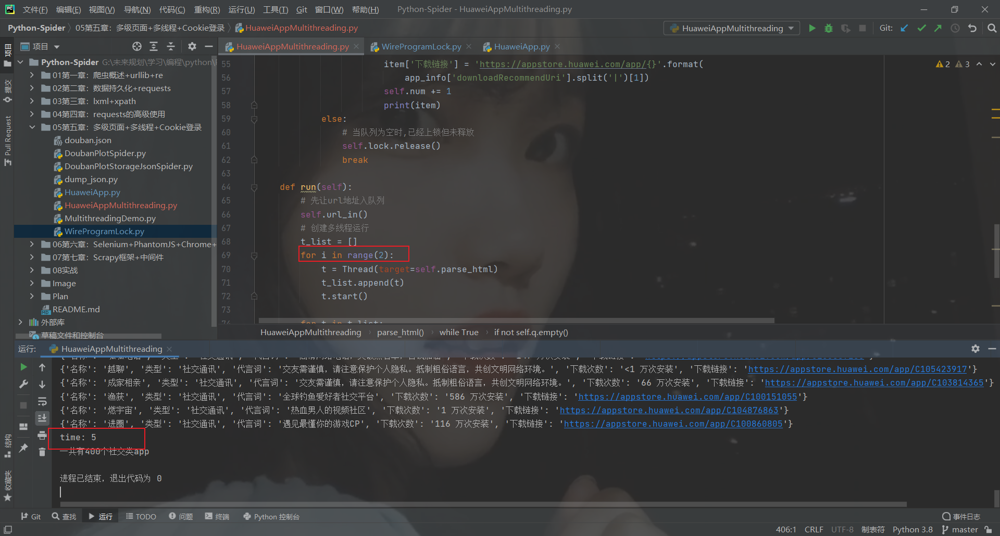

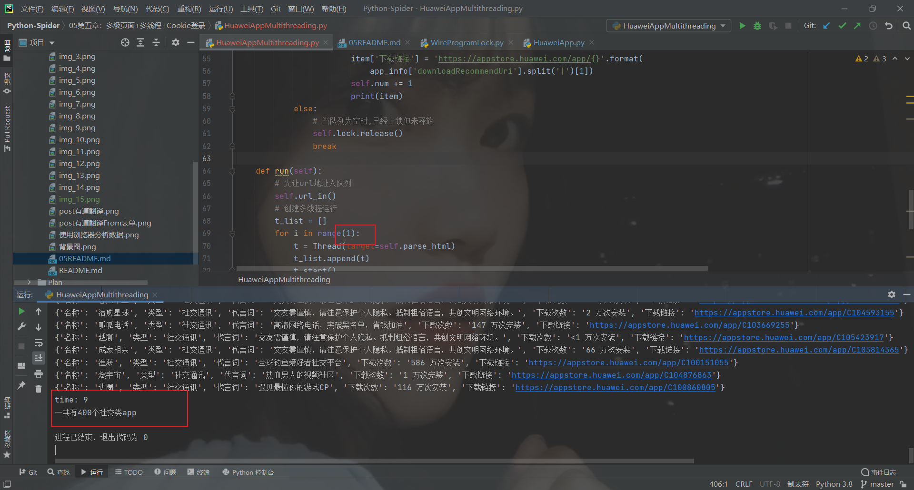


**多线程抓取腾讯招聘职位信息的对比**

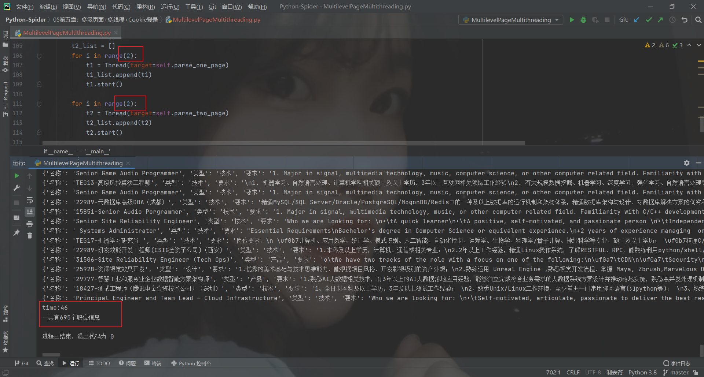


# 多级页面多线程爬取

**思路**
```text
创建多个队列,每个队列存放不同级页面的URL地址

分别从不同的队列中获取URL地址,并找到对应的解析函数提取数据

二级队列以上,队列中获取URL地址时需要用到timeout参数
```

[多线程抓取多级页面 --- 腾讯招聘](https://github.com/LiuShiYa-github/PythonSpider/blob/master/05%E7%AC%AC%E4%BA%94%E7%AB%A0%EF%BC%9A%E5%A4%9A%E7%BA%A7%E9%A1%B5%E9%9D%A2%2B%E5%A4%9A%E7%BA%BF%E7%A8%8B%2BCookie%E7%99%BB%E5%BD%95/MultilevelPageMultithreading.py)

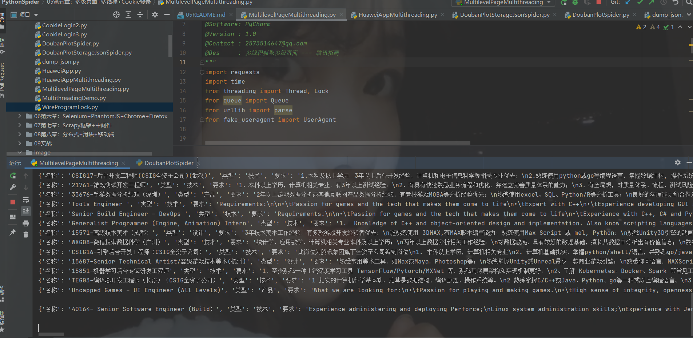

# Cookie模拟登录

```text
适用网站以及场景:
    抓取需要登录才能访问的页面

模拟登录的三种方法:
    利用headers参数,将手动抓取的Cookie放到headers参数中
    利用get()方法中的cookie参数
    利用requests.session()类实现模拟登录
```

**headers参数实现模拟登录**

```text
    登录地址:https://www.douban.com/

    先登录成功1次,获取到携带登录信息的Cookie

    登录成功 - 我的豆瓣 - F12抓包 - 刷新主页 - 找到主页的网路数据包

    定义headers参数,将抓取到的Cookie放入
```

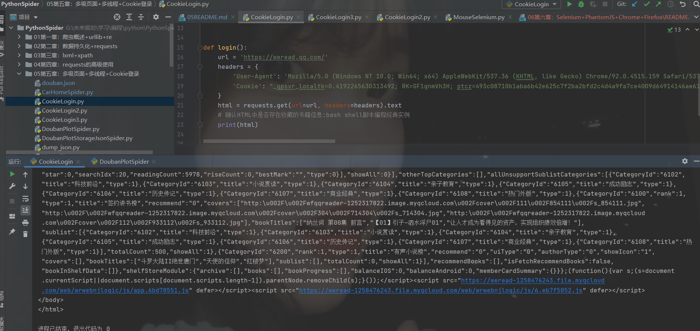

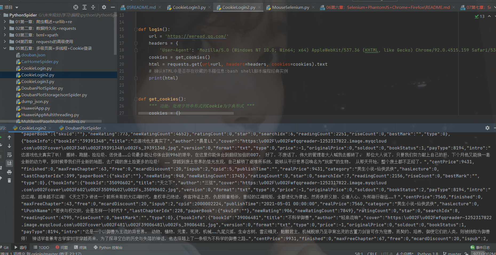


